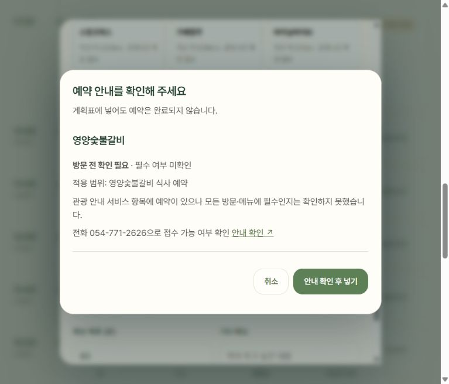

# 경주 혼자 이용·예약 반영 검증

확인일: 2026-10-06 (한국 시간). 기존 경주 장소 176곳 대상이며 신규 장소 추가는 없다.

## 실제 반영

- 음식점 48곳·카페 48곳에 메뉴, 최소 주문, 포장, 독립 좌석 근거, 방문 후기와 시점을 구조화했다. 직접 혼자 식사 원문은 마장동숯불구이 경주본점·고유한우국밥·소향몽·료미 4곳이다.
- 직접 혼자 카페 방문 원문은 스컹크웍스·엘로우·소풍가다 경주양남본점·향미사·오베르·오크냅 러스틱커피 6곳이다. 향미사는 혼자 커피 포장 경험이며 앉아서 식사한 후기로 세지 않는다.
- 좌석 종류 근거는 교리김밥·도미·향미사 3곳에 별도로 남겼다. 과거 좌석 배치이며 현재 전용 1인석 전체를 보증하지 않는다.
- 예약 정보는 20곳·22개 적용 범위다. 필수 8건·권장 5건·필수 여부 미확인 9건이며 장소 전체와 프로그램·단체·메뉴를 구분한다.

## 자동 검사

`npm run test:visits` 통과. 실제 경주 지역을 설정한 추천 엔진에서 명시적 1인 메뉴가 없어도 직접 혼자 식사 후기 한 건이면 식사 후보가 되는지 확인했다. 태그만 있는 후기·포장 전용은 해당 근거로 인정하지 않으며 카페 혼자 방문을 식사로 확대하지 않는다. 전용 좌석 추정 방지, 주문 조건이 있는 1인 방문 허용, 기존 지역 동작 보존, 수동 계획표 필터와 예약 경고 연결도 확인했다.

장소 176곳·혼자 이용 조사 96곳·예약 장소 20곳의 ID, 출처·시점·적용 범위 검사를 통과했다. `npm run sync:preview`, `npm run build`, `git diff --check`를 통과했고 정본·로컬 미리보기·빌드의 경주 데이터 해시가 일치했다. 앞선 기능 검증에서 `npm test` 서버 회귀 검사도 통과했다.

## 브라우저 확인

CUA로 실제 경주 화면을 확인했다. 불국사 카드와 상세는 특별 템플스테이만 예약 필수임을 표시한다. 필수 경고의 취소는 시간·메모를 보존하며, 안내 확인 후 계속 넣기는 계획만 저장하고 예약 완료로 표현하지 않는다. 권장인 화랑마을과 미확인인 영양숯불갈비는 방문 전 확인 필요 문구로 구분한다. Esc 취소도 원래 편집창으로 돌아간다.

향미사 상세에서 혼자 포장한 여행 후기와 동반 방문 글의 바 좌석 근거·게시일을 별도로 확인했다. 실제 계획표의 혼자 여행·식사/카페 선택은 스컹크웍스의 혼자 방문 후기 확인과 가배향주·바이닐바이브의 근거 미확인을 서로 다른 문구로 표시했다. 브라우저 검증용 계획은 별도 127.0.0.1 탭에서 수행했다.

## 미확인과 적용 한계

96곳 전체에 직접 혼자 이용 후기나 현재 주문 규정을 확보한 것은 아니다. 검색·접근 실패 및 미확인은 불가나 좌석 없음으로 바꾸지 않았다. 공개 메뉴 단품 정보는 모든 메뉴의 1인 주문을 뜻하지 않는다. 오래된 원문은 당시 방문·좌석 경험으로만 보존한다. 전화로 현재 정책을 확인한 전수 조사는 아니다.

새 장소의 운영·실제 교통 귀환 검증 전 `researchOnly` 제외를 유지했다. 실제 여행 전체의 동선·운영 가능성을 보증한 검증이 아니라 근거를 선택 조건에 반영한 기능 검증이다. 숙소는 별도 저장 자료를 유지하며 장소 지도에 추가하지 않았다. 이번 작업은 로컬 미리보기 반영이며 공개 배포는 하지 않았다.

원자료: [음식점 조사](혼자여행-음식점-조사.json), [카페 조사](혼자여행-카페-조사.json), [예약 조사](예약-조사.json).
